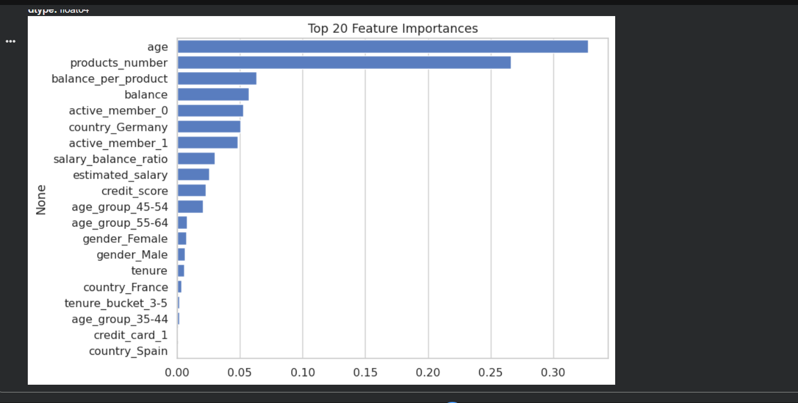
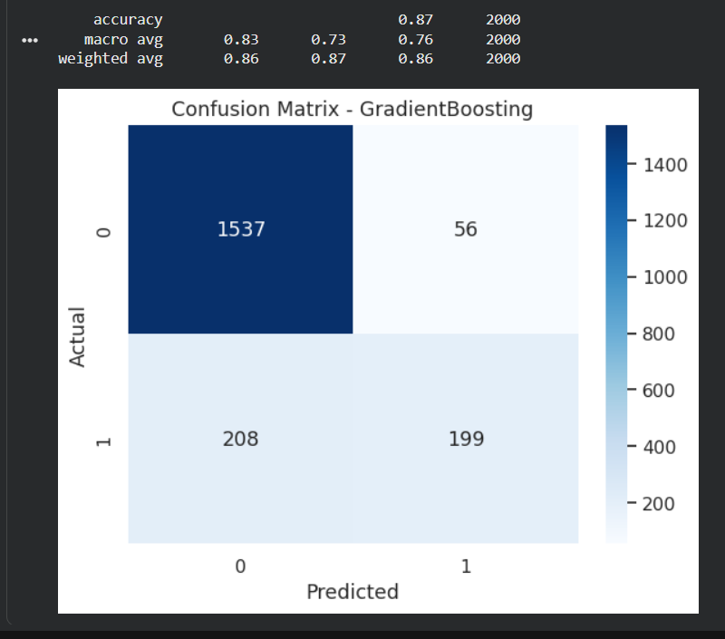
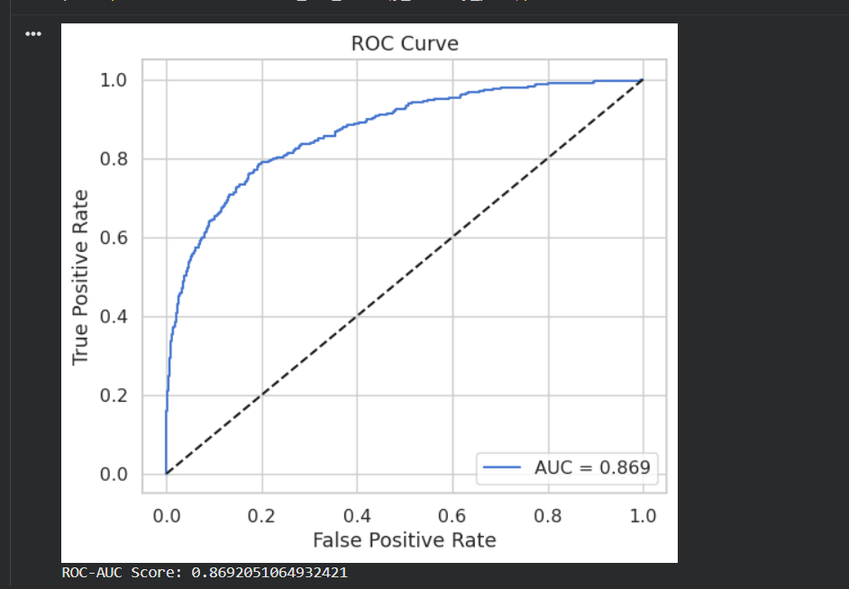
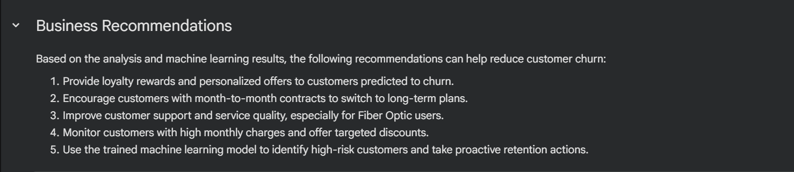

# 🏦 Bank Customer Churn Prediction

## 📌 Project Overview

This project predicts whether a bank customer is likely to leave (churn) using **Python, SQL (SQLite), and Machine Learning**. It includes SQL-based data analysis, exploratory data analysis (EDA), feature engineering, model training, model evaluation, feature importance analysis, and business recommendations to help improve customer retention.

## 🎯 Objectives
- Analyze customer behavior
- Identify factors affecting churn
- Build an accurate churn prediction model
- Provide actionable business recommendations

## 📂 Dataset
- Bank Customer Churn Dataset
- Features include:
  - Credit Score
  - Age
  - Geography
  - Gender
  - Balance
  - Estimated Salary
  - Tenure
  - Number of Products
  - Active Member
  - Credit Card Status

## 🛠 Technologies Used
- Python
- SQL (SQLite)
- Pandas
- NumPy
- Scikit-learn
- Matplotlib
- Seaborn
- Joblib
- Google Colab

## 🚀 Machine Learning Workflow

- Data Cleaning
- SQL Data Analysis
- Exploratory Data Analysis (EDA)
- Feature Engineering
- Data Preprocessing
- Model Training
- Model Evaluation
- Feature Importance Analysis
- Business Recommendations

## ☑ Results

- Built a customer churn prediction model with high predictive performance.
- Performed SQL-based analysis to extract business insights from customer data.
- Identified the most influential factors affecting customer churn.
- Generated business recommendations to improve customer retention and reduce churn.

## 📁 Repository Structure
```
Bank_Customer_Churn_Prediction.ipynb
customer_data.csv
best_churn_pipeline.pkl
README.md
```

## 👨‍💻 Author
**Rameshwar Kawade**
## 📸 Project Screenshots

### Feature Importance


### Confusion Matrix


### ROC Curve


### Business Recommendations

